# Trabajo final Introducción al desarrollo de software
## Instrucciones para montal el proyecto de manera local:

Instalar Docker

Asegurarse de tener los puertos *3000* y *5000* de la maquina disponibles antes de levantar el proyecto

Usar el comando _docker compose up -d_ en la carpeta principal del proyecto para levantar todos los contenedores ya relacionados entre ellos.

El backend se encontrara en el puerto 5000 y el frontend en el puerto 3000.

En caso de que no se desee levantar el proyecto localmente, se puede encontrar desplegado en AWS en un EC2.
[BackEnd](http://backend.idds.saujan.com.ar/*)
[FrontEnd](http://frontend.idds.saujan.com.ar/*)

## Sobre el proyecto:

El proyecto es un CRUD basado en la franqucia de Monster Hunter, cuenta con un servidor de base de datos cuyo volumen, o almacenamiento se encuentra en la carpeta de backend, un servidor de backend con se conecta a la base de datos y contendra los endpoints para poder realizar las operaciones de un CRUD basico, y un frontend que realiza peticiones al backend permitiendo al usuario o cliente una mejor interfaz para menajarse en el Proyecto.

## Muestra del proyecto
Pantalla de inicio, desde aca se puede accede a los CRUDS de cada entidad principal del proyecto.
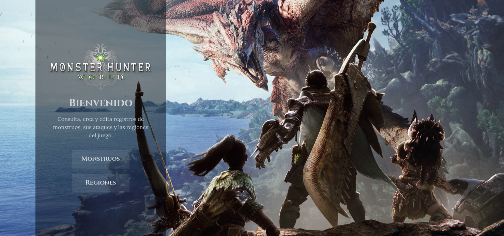

### CRUD de monstruos
Pantalla con las tablas de cada uno de los monstruos donde se ven algunos de los detalles que contiene cada entidad monstruo jutno con botones para ver en detalle cada uno de los mosntruos, volver al menu principal o crear una nueva entidad monstruo.
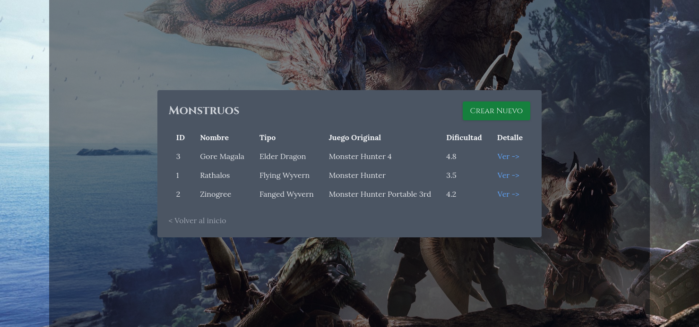

Al hacer click en crear monstruo, se llevara a la pantalla de creacion donde se pediran cada uno de los datos necesarios para crear un nuevo mosntruo, siendo la mayoria de estos requeridos para la creacion de uno, al presionar guardar o volver, se volvera a la tabla que muestra los mosntruos y si se presion crear, se mostrara el nuevo mosntruo creado en la tabla.
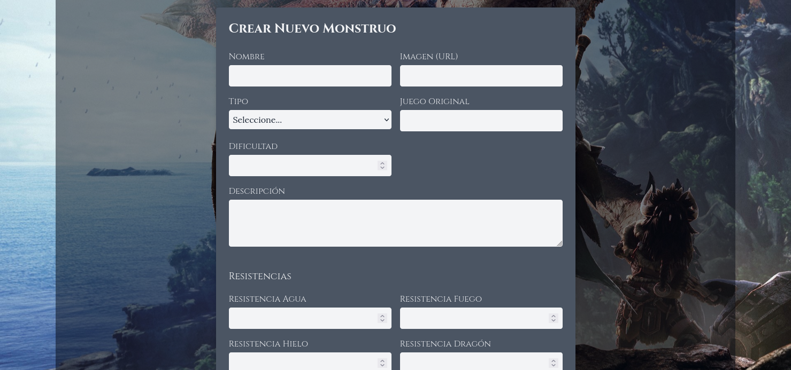

Al hacer click en ver monstruo, se vera los detalles de cada monstruo, junto con una tabla de ataques y las regiones a las que pertenece cada monstruo, tambien se contara con botones para modificar o eliminar dicho mosntruo de la base de datos. Tambien aca se contara con el CRUD para los ataques de cada mosntruo individual y se acceder a los detallers de cada region a la que pertenece el mosntruo.
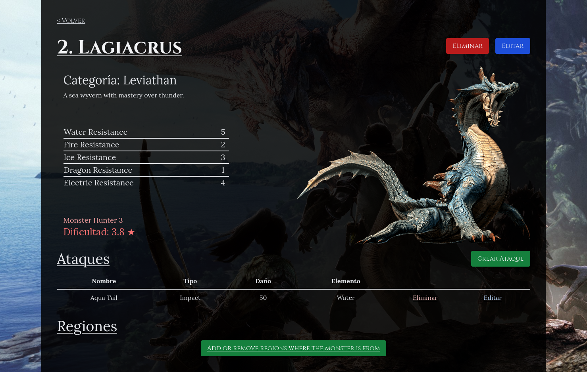

Al presionar el boton de añadir o quitar regiones a las que pertenece el monstruo se permitira ver de asignar al mosntruo a otras regiones insertadas en la base de datos.
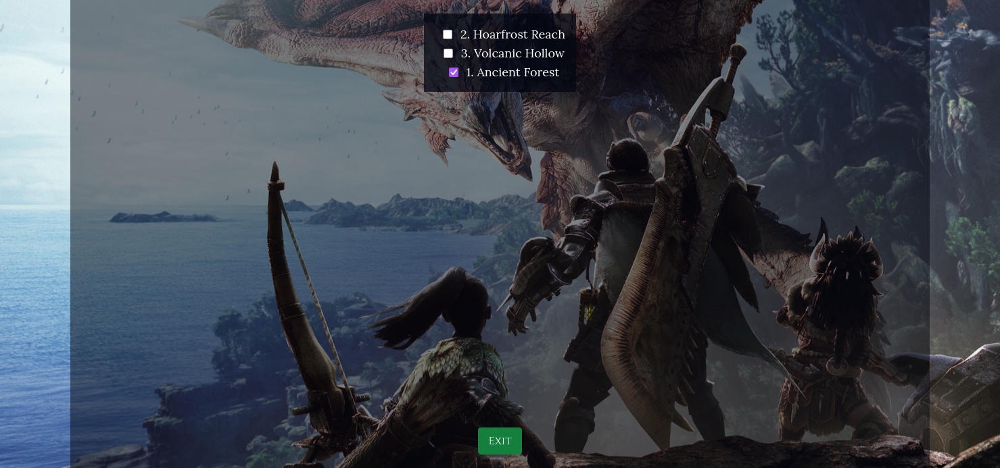

Al presionar el boton de crear ataque se pasara al form para la creaicon de un ataque del monstruo en el que se esta ubicado.
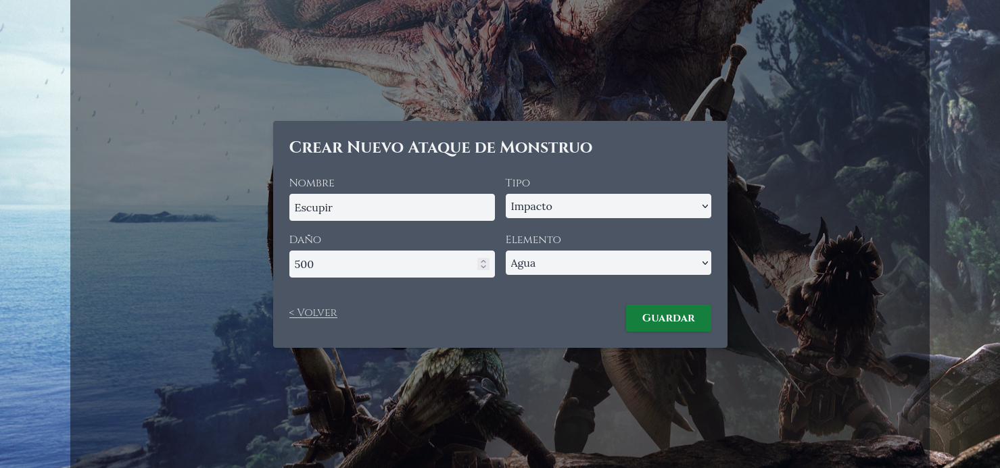

Pantalla de mosntruo luego de asignarle regiones y crear algunos ataques mas.
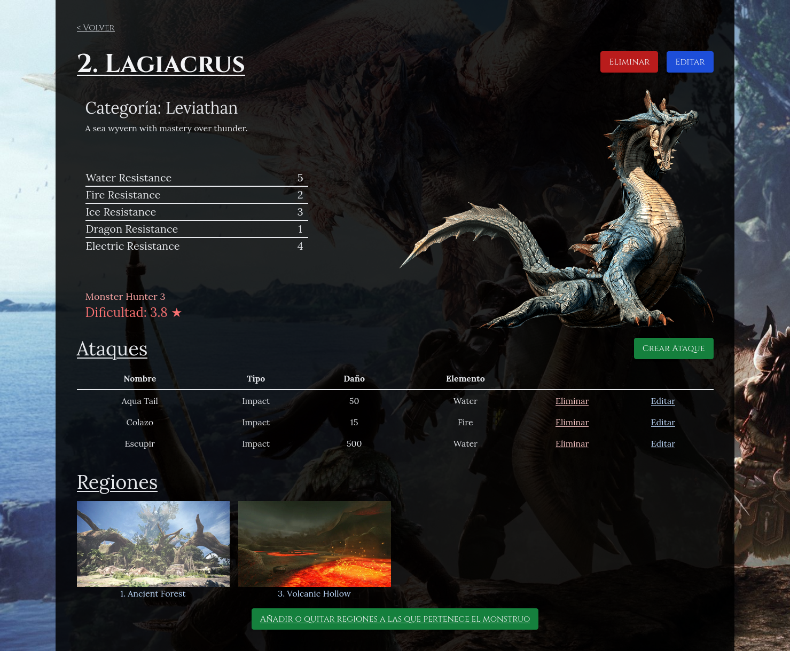

### CRUD de regiones
Pantalla para ver la tabla de cada una de las regiones con algunos detalles de cada region, tambien se dispone desde aca el poder crear regiones o eliminar regiones, al intenter eliminar la region se lanzara un mensaje de confirmacion al usuario antes de la eliminacion definitiva de la region.
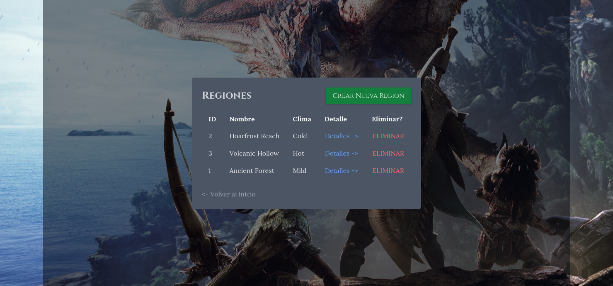

El formulatio de regions funciona de manera similar al de monstruos en el sentido en que se requiere llenar todos o la mayoria de campos para proceder a crear el registro.
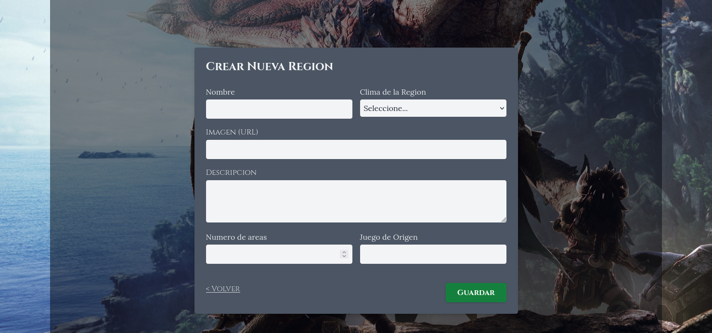

La pantalla detallada de region en donde se podra modificar cada campo de la region a excepcion de los mosntruos que contiene la regions. Para esto se puede acceder al boton de añadir o quitar monstruos de la region que presentara una serie de checkboxes para añadir o quitar monstruos de la region.
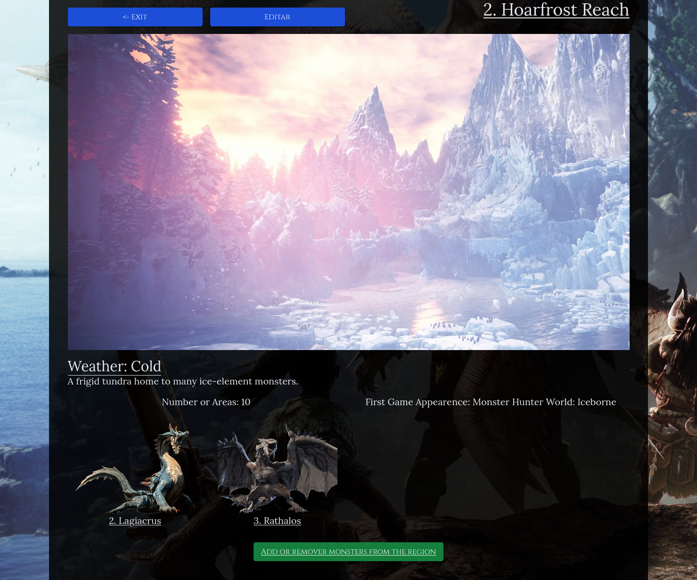

Pantalla de reigon luego de hacer algunos cambios en sus campos y añadir algunos monstruos pertenecientes a la region.
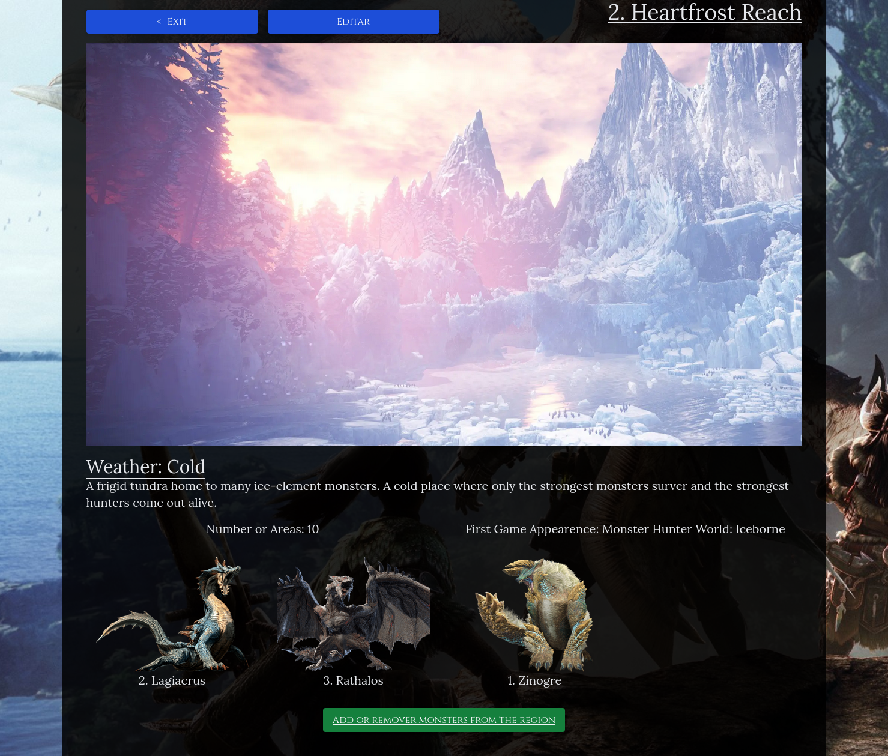